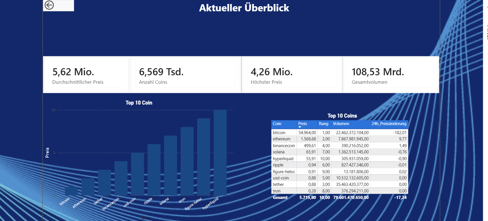
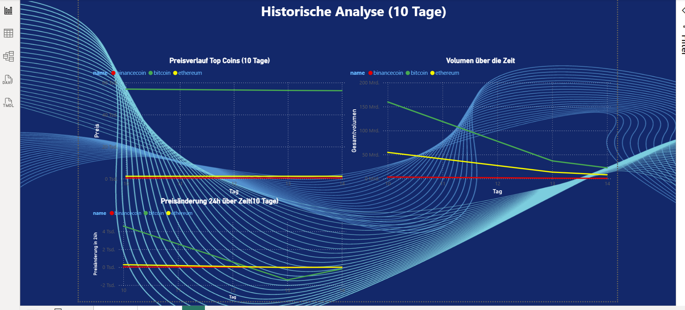

# Crypto Dashboard – Power BI

Wie entwickeln sich Kryptowährungspreise über Zeit, und wie baut 
man eine vollautomatische Datenpipeline von Grund auf?

Automatisierte Historisierung von Marktdaten für 10+ Coins: 
CoinGecko API → Flask → MariaDB (Docker) → Power BI.
Pipeline läuft seit ~14 Tagen, hat 339 Abrufe und 
23.999 Datenpunkte gesammelt, vollautomatisch via Windows Task Scheduler.

**Kernarchitektur:** Flask startet pro Lauf, schreibt in MariaDB 
via Docker, Windows Task Scheduler automatisiert die Ausführung 
täglich, kein manueller Eingriff nötig.

## Dashboard Screenshots

### Seite 1 – Aktueller Überblick

Aktuelle Preise, Market Cap Rank und 24h-Veränderung für 10+ Coins.

### Seite 2 – Historische Analyse

Preisverlauf über 14 Tage – automatisch gesammelt, täglich aktualisiert.

## Projektstruktur

```
crypto-dashboard-powerbi/
├── app.py                          # Flask API (Daten abrufen & speichern)
├── docker-compose.yml              # MariaDB Container
├── requirements.txt
├── .env.example                    # Vorlage für Umgebungsvariablen
├── sql/
│   └── setup.sql                   # Datenbank & Tabellen erstellen
└── scheduler/
    ├── run_collector.py            # Script für Task Scheduler
    ├── collector.log               # Wird automatisch erstellt
    └── task_scheduler_einrichten.md
```

## Setup

### 1. Repository klonen & Umgebung vorbereiten
```bash
git clone https://github.com/Bousaina1/crypto-dashboard-powerbi.git
cd crypto-dashboard-powerbi
cp .env.example .env
# .env öffnen und Passwort eintragen
pip install -r requirements.txt
```

### 2. MariaDB starten
```bash
docker-compose up -d
```

### 3. Flask starten
```bash
python app.py
```

### 4. Ersten Datenabruf testen
Browser oder Terminal:
```
http://localhost:8081/coin
http://localhost:8081/status
```

### 5. Automatisierung einrichten
→ Siehe `scheduler/task_scheduler_einrichten.md`

## Datenbank-Verbindung für Power BI

- Host: `127.0.0.1`
- Port: `3308`
- Datenbank: `crypto`
- Treiber: MariaDB ODBC Connector

## Historisierung

Jeder `/coin`-Aufruf schreibt neue Zeilen in `market_history`.  
`collected_at` ist der Zeitstempel des Abrufs – so lässt sich der Preisverlauf über Zeit auswerten.

## Wichtige SQL-Abfragen

```sql
-- Aktuelle Preise (neuester Abruf)
SELECT coin_id, current_price, collected_at
FROM market_history
WHERE collected_at = (SELECT MAX(collected_at) FROM market_history)
ORDER BY market_cap_rank;

-- Preisverlauf eines bestimmten Coins
SELECT collected_at, current_price
FROM market_history
WHERE coin_id = 'bitcoin'
ORDER BY collected_at;

-- Anzahl Historisierungsläufe
SELECT COUNT(DISTINCT collected_at) AS anzahl_laeufe FROM market_history;
```

## Power BI Views

```sql
-- View für aktuelle Daten (Seite 1)
CREATE VIEW crypto_aktuell AS
SELECT 
    coin_id AS name,
    current_price,
    market_cap_rank,
    high_24h,
    low_24h,
    price_change_24h,
    total_volume,
    collected_at
FROM market_history
WHERE coin_id REGEXP '^[a-zA-Z]'
AND collected_at = (
    SELECT MAX(m2.collected_at) 
    FROM market_history m2
    WHERE m2.coin_id = market_history.coin_id
);

-- View für historische Daten (Seite 2)
CREATE VIEW crypto_historisch AS
SELECT 
    coin_id AS name,
    current_price,
    market_cap_rank,
    price_change_24h,
    total_volume,
    DATE(collected_at) AS datum
FROM market_history
WHERE coin_id REGEXP '^[a-zA-Z]'
ORDER BY coin_id, collected_at;
```
